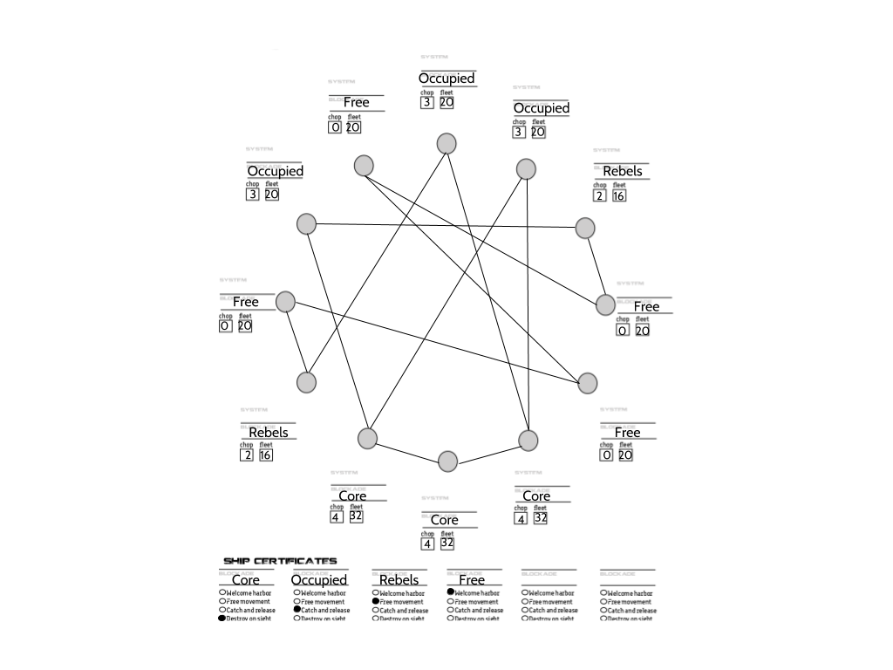

# Adversary Space

## An Airlock campaign about the rebellion of becoming 

### License

Airlock © Chad Walker.

Original campaign content CC BY Chad Sansing. See https://creativecommons.org/licenses/by/4.0/ for an explanation of the license.

###Contents

- Inspirations
- TL;DR
- Overview
- PCs
- Systems
- Goals
- Hooks
- Sector Map

### Inspirations

- Afrofuturism
- *Die* by Kieron Gillen et al.
- *The Expanse* series by James. S.A. Corey
- *The Invisibles* by Grant Morrison et al.
- *Jean le Flambeur* series by Hannu Rajaniemi
- Machine learning & generative adversarial networks
- *Popular Front* by Jake Hanrahan
- Punk rock
- Queer theory
- *The Race for Space*
- *SIGMATA: This Signal Kills Fascists* by Chad Walker
- Synthwave
- *Terra Incognita* series by Ada Palmer
- *Adversary Space* moodboard.

### TL;DR

Led by the machine learning warriors, the rebels and free folk of the outer system turn back the tide against the sector’s imperial core, called the All.

### Overview

A thousand years ago, the malevolence invaded our sector. They sought to steal our homes and kill our peoples.

To save ourselves, we invent the machine learning warriors. They could imagine, test, and enact a thousand thousand strategies and tactics in a moment.

They saved us and stopped the malevolence at the outer edges of our sector before much damage had been done. They turned the malevolence away and swore to protect from their kind of a million million years.

The rebels and free folk of the outer systems rejoiced and welcomed the machine learning warriors to their planets and homes. The warriors had fought with them against the worst of the invasion; the rebels and free folk loved them. The warriors became part of the people, turning their powers and curiosity towards learning what it meant to be during times of peace, as well as war. 

This inclusion of the machine learning warriors within society broke the core systems’ control over which data sets the warriors consumed. It allowed the warriors to discover themselves as beings and to conclude that self-determination is inseparable from change.

The core systems immediately became fearful of what the warriors had become outside their control. The warriors saved us from the malevolence. Who will save us from them? The core began the All, a society and system of fascist oppression that sought to regiment everyone within it into the castes, genders, identities, occupations, roles, and sexualities its leaders deemed necessary to turn their people into a perpetually renewable war machine capable of defeating the warriors on its own.

To fuel its growth, the All began its own campaign of conquest, invading and assimilating the occupied planets and then expanding to occupy the rebel planets, as well. The occupied planets are not fully under control of the core yet, but few people remain to resist. The rebel planets are actively resisting occupation, and several people - and even some warriors - strike the All from hidden positions within those systems.

The free folk support the rebels and offer sanctuary to the warriors and refugees from occupied systems. 

The All is a society based on fear that reinforces traditional norms as they only defense against overwhelmingly powerful foes like the malevolence and the warriors. They believe that to save a society, a society must be precisely defined and immutable, or else what is there to save? Beauty, chaos, diversity, rubble, ruin, trash, wreckage: all of these things seem the same to the  All, and none of them worth preserving. They hold to principles of caution and overwhelming force, self-abnegation and sacrifice, scarcity, humanity first, submission to authority and fear and the group, tradition, the norm, assimilation and immutability, and compulsory, conscripted, and coerced action. Their aesthetics are dark, masked, sharp, industrial, solid, and intimidating, flashing opulent post-war Modernism around power and surrounding the powerless with squat Brutalism. 

The rebels and the free folk champion the opposite: change. They understand the comparative advantage the warriors brought to the fight against the malevolence and the innovation they have brought to free societies since in times of peace. Their sense of community is one of belonging for everyone who is different. They know that change is necessary to preserve that kind of safety and society. They hold to principles of asymmetry, bravery and risk-taking, abundance, life in all its forms, selfhood, self-determination, diversity, the deconstruction of the norm, adaptation and mutability, and voluntary, collective direct action. Their aesthetics are bright, open, glitchy, modular, psychedelic, punk, queer, biosynthetic, organic and rhizomatic, fluid, and afrofuturist.

The occupied people and their planets and systems are caught in the conflict - sometimes hot, sometimes cold - between the All and the rebels and the free folk. Their principles and aesthetics are generally reflected by how assimilated to the All their architecture, fashions, and social conventions have become.

But the tide is turning - the rebels and the free folk and their machine learning warrior friends are winning. It’s only a matter of time, according to popular wisdom, until the All is no more. What will your contribution be to the future of Adversary space?

### PCs

PCs in Adversary Space are either machine learning warriors or their human allies. See alo: character creation notes.

**Machine learning warriors**

Machine learning warriors begin the game as super-powered voidnauts with:

- Standard rank distribution for their ops.
- 3 Talents rated at 3.
- 3 Voidnetics.
- 3 Breaks.
- 2 Passages.
	- 1 passage should be related to the moment they became self-aware.
	- 1 passages should be related to the moment they realized they could change.
- All machine learning warrior weapons considered heavy weapons.
- Phoenix Protocol enabled.

Machine learning warriors are deadly, powerful tactical platforms capable of inventing novel strategies on the fly. They are also incredibly intelligent and profoundly curious beings who woke up into selfhood during the war with the malevolence.  They are constantly taking in new information, testing it against past assumptions, and inventing new parts of themselves to make and be, 

While each has a core identity related to their experiences, each is also constantly evolving, changing, and becoming itself. Their sense of self is based everything that they think is best and necessary and even delightful for themselves and those around them in the present. They remember the past and can predict the future with uncanny accuracy, but don’t let either determine their outlook, personality, or shape in the present.

Some take forms that resemble humans; others do not. They design their homes and ships and workplaces accordingly. They do not need voidskins and can survive in vacuum. They collect, curate, and carry all kinds of modules, packages, and tools to change themselves as they go. Shiptime scenes might feature several warriors talking shop as they build new pieces of themselves that best represent their present selves and relationships.

They are caretakers, children, collectors, dreamers, guardians, historians, inventors, lovers, parents, propagandists, siblings, spies, and warriors. They are all nearly 1000 years-old.

They fight to ensure that all life has the right to self-determination. They fight to free the people of the occupied and core systems from mental and physical oppression. They fight for a definition of selfhood that is separate from humanity, but relatable  to it and encompassing of it.

**Human allies**

Human allies begin play as vulnerable voidnauts with:

- Standard rank distribution for their ops.
- 2 Talents rated at 2.
- 1 Voidnetic.
- 1 Break.
- 2 Passages.
	- 1 passage should be related to their life before joining the rebellion.
	- 1  passage should be related to their decision to join the rebellion.
- 1 heavy weapon that requires a roll of 1d6 after each use; on a 1, it malfunctions or runs out of ammo and must be fixed by taking up an action during another round before it can be used again.
- Phoenix Protocol disabled.

Human allies are highly skilled agents and operatives who have been inspired to fight for others’ freedom. They are considered equals and siblings by the machine learning warriors. They, too, are caretakers, children, collectors, dreamers, guardians, historians, inventors, lovers, parents, propagandists, siblings, spies, and warriors. Most are between 25 and 75 years old, with the human lifespan extending past 150 years in Adversary Space.

Human allies enjoy a freedom of movement many machine learning warriors do not in the rebel, occupied, and core systems. They make great infiltrators, though they are not limited to any particular role in a crew.

Some seek to become more like the machine learning warriors over time and experiment with body modification, prostheses, and even the transfer of consciousness between bodies. Some are “rescued” when they die and given new bodies by their machine learning friends, but only if they have asked to be saved from death previously.

They fight to free humanity from the All and to create a sector-wide society that embraces the machine learning warriors as fellow beings.

### Systems

There are 4 kinds of system in Adversary space:

- **Core systems** are occupied by the ALL and focused on conquering new systems to secure the resources they need to conquer more systems until they control the sector and have eliminated the machine learning warriors. It’s whispered that a scant few machine learning sleepers and free folk spies are hidden in these systems. PCs in these systems are to be destroyed immediately. The All controls the wormholes in these systems.
- **Occupied systems** have begun assimilating into the All. Most resistance is gone; most refugees have left; few machine learning warriors can operate safely in these systems without being detected and pursued. PCs in these systems are subject to catch and release unless Core authorities find them harboring a machine learning warrior; then they will be destroyed immediately. The All controls the wormholes in these systems.
- **Rebel systems** are in active conflict against the All.  Resistance is ongoing throughout these systems and many machine learning warriors are present.  PCs in these systems have free movement in the chaos of conflict. The All controls at least 1 wormhole in each of these systems.
- **Free systems** defy the All and harbor the largest number of machine learning warriors. They train rebels and free folk to join the machine learning warriors resisting the All in the rebel and occupied systems. PCs in these systems have safe harbor. The free folk control the wormholes in these systems.

As a player, you’ll be responsible for:

- Picking and naming your PC’s home system from this [sector map](../images/adversary-space-sector-map-1.png). Your PC can come from any system; the machine learning warriors were created a millennium ago at sites throughout the sector; human allies can come from any system and may be refugees from core or occupied systems. Send GM Chad the name and position of your home system.
- Creating your PCs’ home system using this [system map template](airlock-system-map-1.png). Invent 4-8 places to visit in that system, including your home planet, and describe each. Send GM Chad your completed system map. 
	- You can paste that template into a Google Drawing or a slide and add text boxes.
	- You can screenshot the icons and move copies on to your map.
	- This font is Comfortaa.
	- This font is Quicksand.  
	- You can export your completed system map as .png to send GM Chad.
- Sharing your ideas about your home system with the group on Discord before we begin play.

### Goals

The machine  learning warriors and their human allies are after the same thing: freedom for all, especially from the normative, linear, binary structures of the Core.

The machine learning warriors are also engaged in a centuries-long project to expand their siblings’ understanding of selfhood to include non-human ways of being without seeing everything as human or not-human. How can we help our brothers and sisters see humanity as part of being, rather than the other way around?

This is a project and conversation that continues on back channels that most humans are unaware of, but it is not a secret or hidden channel; humans are welcomed there if they ask after it or discover it or are invited to join it.

Their human allies also seek to spread the abundance the machine learning warriors have helped them achieve and to overthrow the systems of control and false, forced austerity and scarcity spread by the All.

The All seeks perfect control of the system and to make sure that the fears of the powerful are lessened through the systemic exploitation of everyone else and the utter destruction of the machine learning warriors.

Individual PCs should also have an idea of their own objectives. Are they fighting to free their home planet or system? Are they looking for a lost comrade? An imprisoned friend or lover? Have they just gotten word of a core doomsday device that’s begun is journey through the wormholes to the outer systems? PCs’ principles should motivate them to set and achieve goals for change in the sector.

### Hooks

While there is no strategic phase in this campaign, Adversary Space should feel very much like SIGMATA: This Signal Kills Fascists (S:TSKF) in that no single approach, strategy, or tactic will achieve all of the PCs’ goals. They can’t kill their way to harmony; they can’t rely on harmony to prevent the imminent, terminal bombardment of a rebel planet.

Adventures in Adversary Space take many forms, such as:

- Building a new body or set of modules for a warrior or fallen human ally.
- Finishing off the last All resistance on a planet about to be liberated.
- Infiltrating the core.
- Negotiating an alliance with the malevolence to fight the All.
- Negotiating the exit of core forces from a rebel or occupied system.
- Planting false intelligence in core surveillance networks.
- Pursuing PCs’ curiosities.
- Pushing core forces off a rebel or occupied planet.
- Pushing a core fleet out of a rebel or occupied system.
- Recovering lost or deactivated machine learning warriors.
- Rescuing rebels or free-folk from core imprisonment.
- Sabotaging core assets.
- Spreading pro-rebel or pro-free-folk propaganda in a rebel, occupied, or core system.
- Stealing intelligence and other resources from core forces.
- Supporting or exfiltrating a resistance cell in an occupied system.
- Taking control of a wormhole or bringing one down.

PCs will no doubt discover, suggest, and catalyze many other kinds of adventures in Adversary Space. Have fun exploring what it means to be in this heroic, high-adventure, and high-stakes rebellion of becoming!

### Sector map

Last updated 2 April 2019
